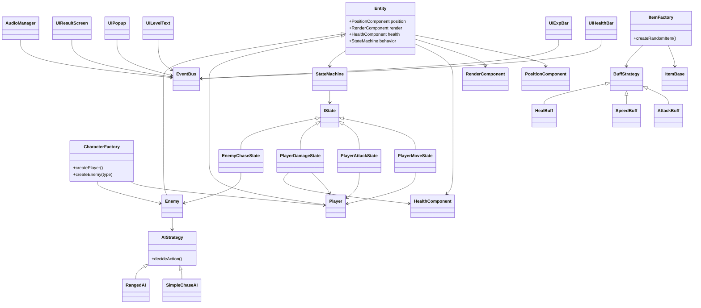

```mermaid

classDiagram

    %% -----------------------
    %% Core: Bridge Pattern
    %% -----------------------
    class Entity {
        +PositionComponent position
        +RenderComponent render
        +HealthComponent health
        +StateMachine behavior
    }

    class PositionComponent {}
    class RenderComponent {}
    class HealthComponent {}
    class StateMachine {}
    class IState {}
    class EventBus {}

    Entity --> PositionComponent
    Entity --> RenderComponent
    Entity --> HealthComponent
    Entity --> StateMachine


    %% -----------------------
    %% Player / Enemy: Factory
    %% -----------------------
    class CharacterFactory {
        +createPlayer()
        +createEnemy(type)
    }

    class Player {}
    class Enemy {}

    CharacterFactory --> Player
    CharacterFactory --> Enemy

    Entity <|-- Player
    Entity <|-- Enemy


    %% -----------------------
    %% State Pattern
    %% -----------------------
    class PlayerMoveState {}
    class PlayerAttackState {}
    class PlayerDamageState {}
    class EnemyChaseState {}

    IState <|-- PlayerMoveState
    IState <|-- PlayerAttackState
    IState <|-- PlayerDamageState
    IState <|-- EnemyChaseState

    StateMachine --> IState
    PlayerMoveState --> Player
    PlayerAttackState --> Player
    PlayerDamageState --> Player
    PlayerDamageState --> HealthComponent
    EnemyChaseState --> Enemy


    %% -----------------------
    %% Strategy Pattern: AI
    %% -----------------------
    class AIStrategy {
        +decideAction()
    }
    class SimpleChaseAI {}
    class RangedAI {}

    AIStrategy <|-- SimpleChaseAI
    AIStrategy <|-- RangedAI

    Enemy --> AIStrategy


    %% -----------------------
    %% Items: Factory + Strategy
    %% -----------------------
    class ItemBase {}
    class BuffStrategy {}
    class AttackBuff {}
    class SpeedBuff {}
    class HealBuff {}

    BuffStrategy <|-- AttackBuff
    BuffStrategy <|-- SpeedBuff
    BuffStrategy <|-- HealBuff

    class ItemFactory {
        +createRandomItem()
    }

    ItemFactory --> ItemBase
    ItemFactory --> BuffStrategy


    %% -----------------------
    %% UI: Observer
    %% -----------------------
    class UIHealthBar {}
    class UIExpBar {}
    class UILevelText {}
    class UIPopup {}
    class UIResultScreen {}

    UIHealthBar --> EventBus
    UIExpBar --> EventBus
    UILevelText --> EventBus
    UIPopup --> EventBus
    UIResultScreen --> EventBus


    %% -----------------------
    %% Audio: Observer
    %% -----------------------
    class AudioManager {}
    AudioManager --> EventBus
```