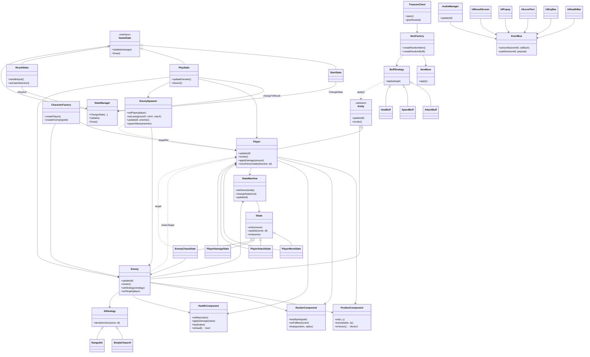

```mermaid
classDiagram

    %% -----------------------
    %% Entities & Components
    %% -----------------------
    class Entity {
        <<abstract>>
        +update(dt)
        +render()
    }
    class Player {
        +update(dt)
        +render()
        +applyDamage(amount)
        +moveHorizontally(direction, dt)
    }
    class Enemy {
        +update(dt)
        +render()
        +setStrategy(strategy)
        +setTarget(player)
    }
    class PositionComponent {
        +set(x, y)
        +translate(dx, dy)
        +toVector(): Vector2
    }
    class RenderComponent {
        +loadSprite(path)
        +setFallback(color)
        +draw(position, radius)
    }
    class HealthComponent {
        +setMax(value)
        +applyDamage(value)
        +heal(value)
        +isDead(): bool
    }
    class StateMachine {
        +setOwner(entity)
        +changeState(next)
        +update(dt)
    }
    class IState {
        +enter(owner)
        +update(owner, dt)
        +exit(owner)
    }

    Entity <|-- Player
    Entity <|-- Enemy

    Player --> PositionComponent
    Player --> RenderComponent
    Player --> HealthComponent
    Player --> StateMachine

    Enemy --> PositionComponent
    Enemy --> RenderComponent
    Enemy --> HealthComponent
    Enemy --> StateMachine
    Enemy --> AIStrategy
    Enemy ..> Player : chaseTarget


    %% -----------------------
    %% Behavior: State Pattern
    %% -----------------------
    StateMachine --> IState
    class PlayerMoveState
    class PlayerAttackState
    class PlayerDamageState
    class EnemyChaseState

    IState <|-- PlayerMoveState
    IState <|-- PlayerAttackState
    IState <|-- PlayerDamageState
    IState <|-- EnemyChaseState

    PlayerMoveState --> Player
    PlayerAttackState --> Player
    PlayerDamageState --> Player
    EnemyChaseState --> Enemy
    EnemyChaseState ..> Player : target


    %% -----------------------
    %% Strategy: Enemy AI
    %% -----------------------
    class AIStrategy {
        +decideAction(owner, dt)
    }
    class SimpleChaseAI
    class RangedAI

    AIStrategy <|-- SimpleChaseAI
    AIStrategy <|-- RangedAI


    %% -----------------------
    %% Factories & Spawners
    %% -----------------------
    class CharacterFactory {
        +createPlayer()
        +createEnemy(typeId)
    }
    class EnemySpawner {
        +setPlayer(player)
        +setLane(groundY, minX, maxX)
        +update(dt, enemies)
        +spawnWave(enemies)
    }

    CharacterFactory --> Player
    CharacterFactory --> Enemy
    EnemySpawner --> Enemy
    EnemySpawner ..> Player : targetRef


    %% -----------------------
    %% Game Flow: StateManager
    %% -----------------------
    class GameState {
        <<interface>>
        +Update(manager)
        +Draw()
    }
    class StateManager {
        +ChangeState<T>(...)
        +Update()
        +Draw()
    }
    class StartState
    class PlayState {
        +updateEnemies()
        +drawUI()
    }
    class ResultState {
        +handleInput()
        +activateSelection()
    }

    StateManager --> GameState
    GameState <|-- StartState
    GameState <|-- PlayState
    GameState <|-- ResultState
    StartState --> StateManager : ChangeState<PlayState>
    PlayState --> StateManager : changeToResult
    ResultState --> StateManager : retry/exit
    PlayState --> Player
    PlayState --> EnemySpawner
    PlayState --> Enemy


    %% -----------------------
    %% Items: Factory + Strategy
    %% -----------------------
    class ItemBase {
        +apply()
    }
    class BuffStrategy {
        +apply(target)
    }
    class AttackBuff
    class SpeedBuff
    class HealBuff
    class ItemFactory {
        +createRandomItem()
        +createRandomBuff()
    }
    class TreasureChest {
        +open()
        +giveReward()
    }

    ItemFactory --> ItemBase
    ItemFactory --> BuffStrategy
    BuffStrategy <|-- AttackBuff
    BuffStrategy <|-- SpeedBuff
    BuffStrategy <|-- HealBuff
    BuffStrategy ..> Entity : apply()
    TreasureChest --> ItemFactory


    %% -----------------------
    %% UI & Audio via EventBus
    %% -----------------------
    class EventBus {
        +subscribe(eventId, callback)
        +publish(eventId, payload)
    }
    class UIHealthBar
    class UIExpBar
    class UILevelText
    class UIPopup
    class UIResultScreen
    class AudioManager {
        +update(dt)
    }

    UIHealthBar --> EventBus
    UIExpBar --> EventBus
    UILevelText --> EventBus
    UIPopup --> EventBus
    UIResultScreen --> EventBus
    AudioManager --> EventBus
```