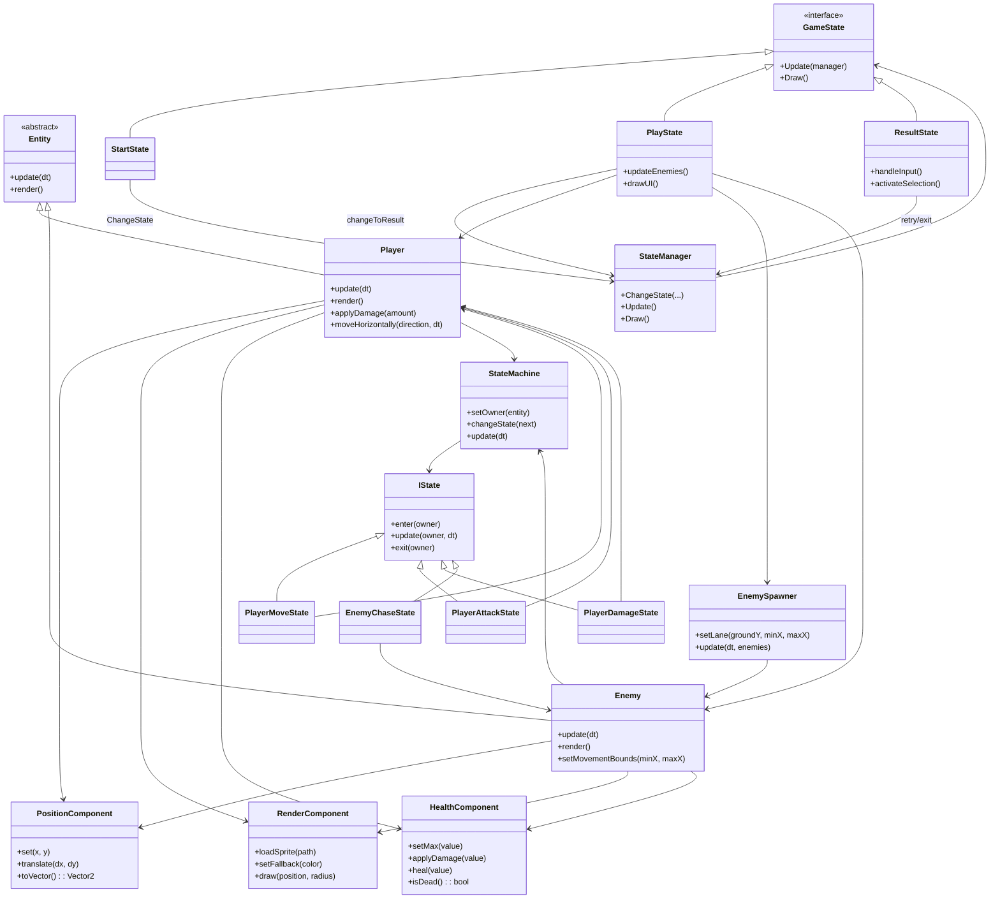

```mermaid
classDiagram

    %% -----------------------
    %% Entities & Components
    %% -----------------------
    class Entity {
        <<abstract>>
        +update(dt)
        +render()
    }
    class Player {
        +update(dt)
        +render()
        +applyDamage(amount)
        +moveHorizontally(direction, dt)
    }
    class Enemy {
        +update(dt)
        +render()
        +setMovementBounds(minX, maxX)
    }
    class PositionComponent {
        +set(x, y)
        +translate(dx, dy)
        +toVector(): Vector2
    }
    class RenderComponent {
        +loadSprite(path)
        +setFallback(color)
        +draw(position, radius)
    }
    class HealthComponent {
        +setMax(value)
        +applyDamage(value)
        +heal(value)
        +isDead(): bool
    }
    class StateMachine {
        +setOwner(entity)
        +changeState(next)
        +update(dt)
    }
    class IState {
        +enter(owner)
        +update(owner, dt)
        +exit(owner)
    }

    Entity <|-- Player
    Entity <|-- Enemy

    Player --> PositionComponent
    Player --> RenderComponent
    Player --> HealthComponent
    Player --> StateMachine

    Enemy --> PositionComponent
    Enemy --> RenderComponent
    Enemy --> HealthComponent
    Enemy --> StateMachine


    %% -----------------------
    %% Behavior: State Pattern
    %% -----------------------
    StateMachine --> IState
    class PlayerMoveState
    class PlayerAttackState
    class PlayerDamageState
    class EnemyChaseState

    IState <|-- PlayerMoveState
    IState <|-- PlayerAttackState
    IState <|-- PlayerDamageState
    IState <|-- EnemyChaseState

    PlayerMoveState --> Player
    PlayerAttackState --> Player
    PlayerDamageState --> Player
    EnemyChaseState --> Enemy


    %% -----------------------
    %% Factories & Spawners
    %% -----------------------

    class EnemySpawner {
        +setLane(groundY, minX, maxX)
        +update(dt, enemies)
    }
    EnemySpawner --> Enemy


    %% -----------------------
    %% Game Flow: StateManager
    %% -----------------------
    class GameState {
        <<interface>>
        +Update(manager)
        +Draw()
    }
    class StateManager {
        +ChangeState<T>(...)
        +Update()
        +Draw()
    }
    class StartState
    class PlayState {
        +updateEnemies()
        +drawUI()
    }
    class ResultState {
        +handleInput()
        +activateSelection()
    }

    StateManager --> GameState
    GameState <|-- StartState
    GameState <|-- PlayState
    GameState <|-- ResultState
    StartState --> StateManager : ChangeState<PlayState>
    PlayState --> StateManager : changeToResult
    ResultState --> StateManager : retry/exit
    PlayState --> Player
    PlayState --> EnemySpawner
    PlayState --> Enemy


```